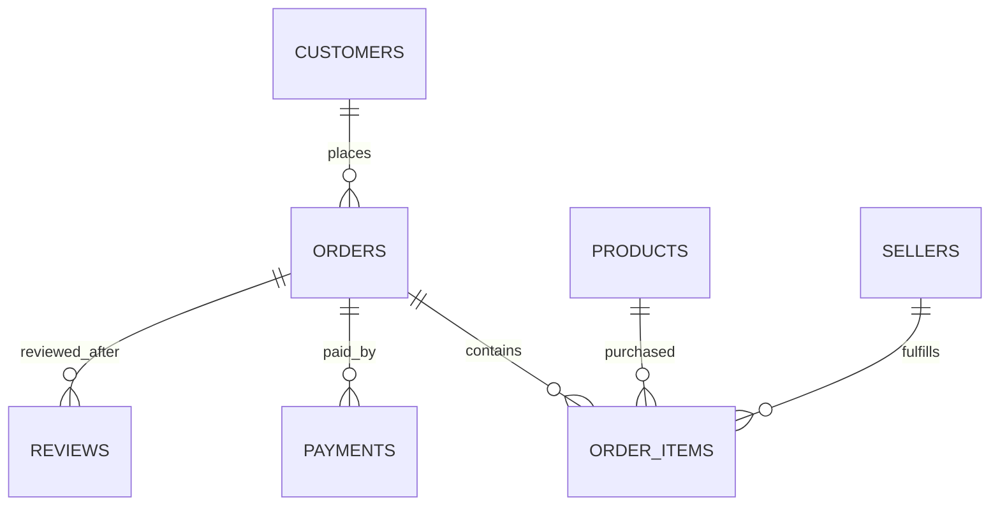
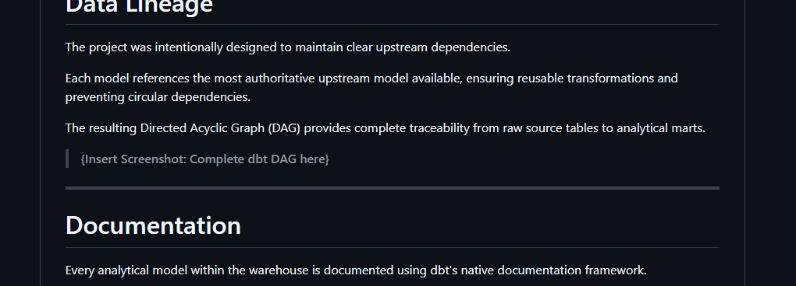

# Olist Analytics Engineering Project with dbt

## Project Overview

This repository contains an end-to-end analytics engineering project built using **dbt (Data Build Tool)** and **DuckDB**, using the publicly available Olist Brazilian e-commerce dataset.

The objective of this project was not simply to transform raw data into analytical tables, but to demonstrate the complete analytics engineering workflow involved in designing a modern data warehouse. The implementation emphasizes dimensional modeling, modular SQL transformations, data quality testing, documentation, and maintainable data lineage.

Rather than treating dbt as a SQL execution tool, this project adopts the principles commonly used in production analytics engineering teams:

* Layered data transformations
* Explicit model grain definitions
* Reusable intermediate models
* Conformed dimensions
* Transactional fact tables
* Automated data quality testing
* Comprehensive model documentation
* Clear and maintainable data lineage

Throughout the project, each transformation was designed around a single guiding principle:

> **Profile the data first, define the grain second, and only then write the SQL.**

This approach ensures that every model is built on validated assumptions instead of inferred relationships.

The resulting warehouse provides a clean analytical representation of the Olist marketplace, covering the complete customer purchasing lifecycle—from customer registration and order placement to payments, products, sellers, and customer reviews.

Although the Olist dataset is static, the project follows engineering practices that are directly transferable to production analytics environments and demonstrates how dbt can be used to build reliable, well-documented, and testable analytical data models.

---

## Business Context

Olist is a Brazilian e-commerce marketplace that connects customers with thousands of independent sellers across Brazil.

The dataset captures several core business domains, including:

* Customers
* Orders
* Order Items
* Products
* Sellers
* Payments
* Customer Reviews

These domains originate from independent source tables and contain varying levels of data quality, duplication, and normalization. Before they can support business intelligence and reporting, they require careful modeling into a coherent analytical warehouse.

The primary business objective of this project is to transform these operational datasets into a dimensional model that enables reliable analysis of:

* Customer purchasing behavior
* Product performance
* Seller performance
* Revenue generation
* Payment patterns
* Customer satisfaction
* Order lifecycle performance

Instead of creating direct SQL reports from raw data, this project builds reusable analytical assets that can serve as a trusted foundation for dashboards, ad hoc analysis, and downstream business intelligence tools.

---

## Project Objectives

The project was designed around the following engineering objectives:

* Build a layered dbt project using staging, intermediate, and mart models.
* Apply dimensional modeling principles to create conformed dimensions and transactional fact tables.
* Preserve explicit model grain throughout every transformation.
* Validate assumptions through data profiling before implementing transformations.
* Implement automated data quality tests using dbt.
* Document models and columns to produce self-explanatory project documentation.
* Maintain clean and traceable data lineage through appropriate model dependencies.
* Produce a repository that demonstrates analytics engineering best practices rather than simply SQL proficiency.

Ultimately, the goal of this project is to demonstrate a practical understanding of modern analytics engineering using dbt—from raw source ingestion to a fully documented analytical warehouse.


---

# Warehouse Architecture

## Architectural Approach

The warehouse follows a layered transformation architecture based on dbt best practices. Each layer has a single responsibility, allowing transformations to remain modular, reusable, and easy to maintain.

Rather than transforming raw data directly into reporting tables, data progresses through successive refinement stages:

```text
Raw Data
    │
    ▼
Sources
    │
    ▼
Staging Models
    │
    ▼
Intermediate Models
    │
    ▼
Mart Layer
    ├── Dimension Tables
    └── Fact Tables
```

Each layer builds upon the previous one without bypassing the architecture, resulting in predictable data lineage and clear separation of responsibilities.

---

## Transformation Layers

### Source Layer

The Source layer represents the raw Olist datasets loaded into DuckDB.

No business logic is applied at this stage. Source definitions establish the connection between dbt and the underlying tables while enabling lineage tracking and source-level testing.

Responsibilities:

* Register raw datasets
* Preserve original source structure
* Serve as the authoritative entry point into the transformation pipeline

---

### Staging Layer

The staging layer standardizes each raw dataset into a clean, consistent representation.

Transformations in this layer intentionally remain lightweight and avoid business logic.

Typical staging transformations include:

* Renaming columns
* Casting data types
* Removing unnecessary columns
* Standardizing naming conventions
* Preserving the original grain

Each staging model corresponds to a single source table, making this layer easy to understand and maintain.

---

### Intermediate Layer

Intermediate models encapsulate reusable business logic.

Rather than embedding calculations directly into fact or dimension models, common transformations are centralized here so they can be reused across multiple downstream models.

Examples include:

* Order payment aggregation
* Product sales metrics
* Seller performance metrics
* Customer purchasing metrics
* Product category translation

This separation minimizes duplicated SQL while improving maintainability and consistency.

---

### Mart Layer

The mart layer contains the analytical warehouse presented to downstream consumers.

It is organized into two categories:

#### Dimension Tables

Dimensions describe business entities.

Current dimensions include:

* Customers
* Products
* Sellers

Dimension models provide descriptive attributes that support filtering, grouping, and slicing analytical queries.

---

### Fact Tables

Facts capture measurable business events.

Current fact tables include:

* Orders
* Order Items
* Payments
* Reviews

Each fact table has a clearly documented grain and references conformed dimensions to provide analytical context while preserving transactional detail.

---

## Data Lineage

A key design objective throughout the project was maintaining clean and predictable lineage.

Every transformation references the most authoritative upstream model available.

Examples include:

* Fact tables depend on staging models and reusable intermediate models.
* Intermediate models never depend on mart models.
* Dimensions are built independently of facts whenever possible.
* Shared business logic is implemented once and reused downstream.

This approach keeps the Directed Acyclic Graph (DAG) easy to understand while avoiding circular dependencies and duplicated transformation logic.

---

## Modeling Principles

Several engineering principles guided every model developed throughout the project.

### Define the grain before writing SQL

Each model explicitly documents its grain before implementation.

This ensures joins preserve row-level integrity and prevents accidental duplication of business events.

---

### Profile data before modeling

Source data was profiled before designing transformations.

Examples include validating:

* Primary keys
* Composite keys
* Duplicate records
* Cardinality
* Relationship integrity

Modeling decisions were driven by observed data characteristics rather than assumptions.

---

### Reuse transformations

Business logic is implemented once within intermediate models and reused throughout the warehouse.

This reduces maintenance effort while ensuring analytical consistency across downstream models.

---

### Preserve authoritative lineage

Each model references the most appropriate upstream source.

The warehouse intentionally avoids reverse dependencies, such as intermediate models depending on marts, ensuring every transformation layer remains reusable and logically independent.

---

# Data Model

The analytical warehouse follows a dimensional modeling approach, organizing data into **fact tables** that capture business events and **dimension tables** that provide descriptive context.

This design supports intuitive analytical queries while preserving the transactional integrity of the underlying operational data.

---

## Warehouse Overview

The warehouse is centered around the customer purchasing lifecycle.

Customers place orders containing one or more order items. Each order may have one or more associated payment transactions and can receive one or more customer reviews. Products are sold by sellers, providing the business context required for analytical reporting.



> **{Insert Screenshot: Warehouse lineage (Facts & Dimensions) from dbt Docs here}**

---

# Fact Tables

Fact tables capture measurable business events at explicitly defined grains.

| Model             | Grain                                              | Business Event             |
| ----------------- | -------------------------------------------------- | -------------------------- |
| `fct_orders`      | One row per order                                  | Customer order lifecycle   |
| `fct_order_items` | One row per order item                             | Individual purchased items |
| `fct_payments`    | One row per payment transaction                    | Order payment events       |
| `fct_reviews`     | One row per review record associated with an order | Customer feedback          |

Each fact table preserves transactional detail while exposing foreign keys that connect to the corresponding dimensions.

---

## Fact: Orders

Represents the complete lifecycle of a customer order.

This model captures order-level timestamps and status information while enriching each order with customer context and aggregated payment information.

Typical analyses include:

* Revenue by order
* Order lifecycle performance
* Delivery performance
* Customer purchasing activity

---

## Fact: Order Items

Represents individual items purchased within an order.

Because a single order may contain multiple products from multiple sellers, this fact provides the lowest transactional grain for product and seller analysis.

Typical analyses include:

* Product revenue
* Seller performance
* Product popularity
* Freight costs
* Basket composition

---

## Fact: Payments

Represents payment transactions associated with customer orders.

Orders may contain multiple payment records, making this model suitable for payment behavior analysis.

Typical analyses include:

* Payment methods
* Installment usage
* Payment value distribution
* Revenue by payment type

---

## Fact: Reviews

Represents customer review records associated with completed orders.

During exploratory profiling, it was discovered that neither `review_id` nor `order_id` uniquely identifies a review. The implemented grain therefore uses the composite natural key (`review_id`, `order_id`), preserving the characteristics of the source data without introducing artificial uniqueness.

Typical analyses include:

* Customer satisfaction
* Review score distribution
* Review trends
* Customer feedback

---

# Dimension Tables

Dimension tables describe the core business entities referenced by the fact tables.

Unlike transactional facts, dimensions provide descriptive attributes used for filtering, grouping, and aggregation.

| Model           | Business Entity      |
| --------------- | -------------------- |
| `dim_customers` | Customer information |
| `dim_products`  | Product catalog      |
| `dim_sellers`   | Marketplace sellers  |

---

## Customer Dimension

Contains descriptive information about customers, including geographic attributes and customer identifiers.

This dimension supports customer segmentation and regional analysis.

---

## Product Dimension

Contains descriptive product attributes including category information and physical characteristics.

The product dimension is enriched using translated category information to provide more meaningful analytical outputs.

---

## Seller Dimension

Contains descriptive information about marketplace sellers.

This dimension enables seller-level performance analysis across products, orders, and revenue.

---

# Intermediate Models

Intermediate models encapsulate reusable business logic shared across multiple downstream models.

Rather than embedding calculations directly into fact or dimension models, reusable transformations are isolated into dedicated models.

Examples include:

* Customer purchasing metrics
* Product sales metrics
* Seller performance metrics
* Order payment aggregations
* Product category translations

This approach minimizes duplicated SQL while improves maintainability and keeps business logic centralized.

---

# Data Lineage

The project was intentionally designed to maintain clear upstream dependencies.

Each model references the most authoritative upstream model available, ensuring reusable transformations and preventing circular dependencies.

The resulting Directed Acyclic Graph (DAG) provides complete traceability from raw source tables to analytical marts.

> **{Insert Screenshot: Complete dbt DAG here}**

---

# Documentation

Every analytical model within the warehouse is documented using dbt's native documentation framework.

Documentation includes:

* Model descriptions
* Column descriptions
* Model grain
* Data lineage
* Automated data tests

The generated documentation enables downstream users to understand each model without reading the SQL implementation.

> **{Insert Screenshot: dbt Docs homepage here}**


---

# Data Quality & Testing

Reliable analytics begin with reliable data.

A core objective of this project was to ensure that every analytical model was built on validated assumptions rather than inferred relationships. Before implementing transformations, the underlying datasets were profiled to understand their grain, cardinality, uniqueness, and referential integrity.

These findings informed both the warehouse design and the automated tests implemented throughout the project.

---

## Testing Philosophy

The testing strategy follows a simple principle:

> **Every model should verify the assumptions on which it was built.**

Rather than applying tests uniformly across every column, each test was selected based on the role of the model and the business rules governing the data.

For example:

* Primary business identifiers should never be null.
* Relationships between facts and dimensions should remain valid.
* Enumerated business fields should only contain expected values.
* Composite natural keys should remain unique where required.
* Model grain should never change unexpectedly.

This approach ensures that tests validate business integrity rather than merely increasing the number of passing checks.

---

## Testing Workflow

The testing process followed the same lifecycle for every model.


This workflow helped identify data quality issues before they propagated into downstream models.

---

# Data Profiling

Before building each model, exploratory analysis was performed to validate assumptions about the source data.

Profiling activities included:

* Row count validation
* Duplicate detection
* Primary key validation
* Composite key validation
* Referential integrity checks
* Cardinality analysis
* Business rule verification

Several important modeling decisions emerged directly from this profiling process.

For example:

* Customer identifiers were found to represent multiple customer records over time, requiring careful interpretation.
* Product identifiers were confirmed to be unique and suitable as natural keys.
* Payment records required a composite key of (`order_id`, `payment_sequential`).
* Review records required a composite key of (`review_id`, `order_id`) because neither field was independently unique.

These observations ensured that the warehouse reflected the true characteristics of the source data rather than idealized assumptions.

---

# Implemented Tests

The project uses dbt's native testing framework together with `dbt_utils` to validate data quality.

Implemented test categories include:

| Test Type                                 | Purpose                                         |
| ----------------------------------------- | ----------------------------------------------- |
| `not_null`                                | Ensures mandatory business fields are populated |
| `relationships`                           | Validates referential integrity between models  |
| `accepted_values`                         | Restricts categorical fields to expected values |
| `unique`                                  | Verifies uniqueness of natural keys             |
| `dbt_utils.unique_combination_of_columns` | Validates composite business keys               |

These tests are executed automatically during project builds, providing continuous validation of warehouse integrity.

---

# Documentation-Driven Development

Documentation and testing were developed together.

Each model includes:

* Model description
* Column descriptions
* Explicit grain definition
* Appropriate data quality tests

This ensures that documentation remains synchronized with the implementation rather than becoming an afterthought.

---

# Validation Beyond dbt Tests

Automated tests alone cannot guarantee analytical correctness.

Throughout development, additional validation queries were used to verify:

* Grain preservation
* Revenue consistency across models
* Aggregation accuracy
* Join cardinality
* Row-count reconciliation
* Source-to-model consistency

These analytical validation steps complemented dbt's automated testing framework and provided greater confidence in the correctness of each transformation.

---

# Quality Outcomes

By combining exploratory profiling with automated validation, the resulting warehouse provides:

* Clearly defined model grain
* Preserved transactional integrity
* Trusted foreign key relationships
* Consistent business metrics
* Self-documenting analytical models
* Repeatable validation through dbt

Rather than relying solely on SQL correctness, the project emphasizes **confidence in the analytical outputs**, ensuring that downstream reporting is built upon a reliable and well-tested foundation.

> **{Insert Screenshot: dbt test output showing all tests passing}**

> **{Insert Screenshot: dbt Docs test coverage or model documentation showing tests}**
